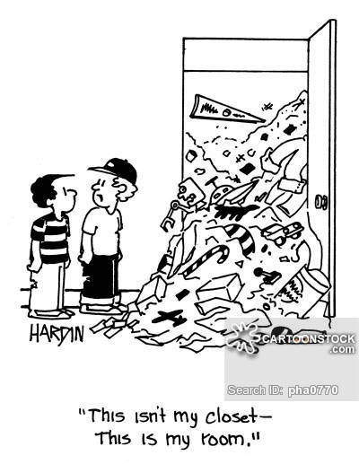
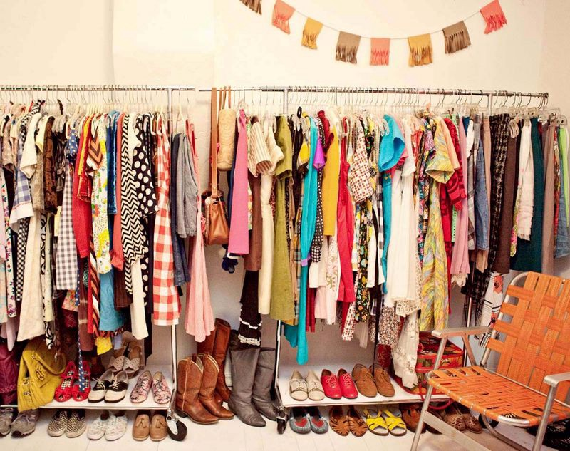

One good thing about **_arrays_** is that you can walk through them like strolling through a garden, picking up flowers you like(ones that match a condition), ignoring the rest, taking in the beauty of it all with a deep breath( summing it all up). You can even draw out conclusions and sketch out a map of your favourite route in the garden footpath can’t you? Well keep this analogy in mind as we go through every prototype function of arrays in Javascript

1.  **filter() **— As simple as picking up flowers of the color you like. This will return an array containing only those elements that suffice a condition. If you are using Es6 as you should be by now, you would write it as this: `**arr.filter((ele) => (ele >3))**`
2.  **map()** — As easy as sketching out a favourite route on the garden footpath to follow each day like you would follow a map ;), and if every day you collect a flower from the hill at the destination of your route, the resultant basket is exactly what this function would return. This function returns an array containing only those elements that have been treated with the function called in for each element. `**arr.map((x) => x)**`
3.  **reduce() **— Well this is like when you go for a walk with binoculars and have several views. You could reach conclusions, find the best tree to climb, note down which birds nest at the top branches, etc. Yep all that. `**const sum = arr.reduce((a,b) =>a+b)**` gives total sum while just 2 lines can `**const obj = arr.reduce((acc, ele, i) => { acc[i] = ele; return acc })**` convert an array to an object!
4.  **forEach()** — Now after all this, this one is a piece of cake! loops through each element. Period. Note: No array returned. You may click the picture of every single flower you see, or pluck each one(ouch :( ) or water them(yay!) anything. `**arr.forEach((flower) => clickPic(flower))**`
5.  **for of** is a new variety that can iterate over objects!(yes you read it right!) over arrays, maps, etc. heres how:

`for (let arg of args) { // Here args is an object  
 arg.type = ‘text’ // well so is arg, so it was an object of objects!  
 return arg //don't kill me if this doesn't work, check out if the browser supports this or not.   
 }`

Now for the rest of the functions I need you to think of a boring Saturday when you decide to organize your closet or room, finally, into something like this.

As you go through the closet(which could have be an array) You might want

1.  **splice() **— throw somethings out `trouser_Skirts.splice(position, how_many)`
2.  **sort()** — arrange all shirts by color/size `shirts.sort()` And your mom might just walk in and run a `shirts.reverse()` 🙄
3.  **split()/join() **— Keep all the work pants together apart from the party ones. Just like `pants.split(“,”)` or `pants.join(“ ”)`
4.  **shift()/unshift()** — If you have an OCD for keeping the least things at topmost layer of the closet, you may be fickle minded whether to remove or add something to the top. `topShelf.shift()` removing it and then changing your mind by `topShelf.unshift().`
5.  **push()/pop()** — Finally the shoes at the bottom of the closed. Kick in some by `Shelves.push(‘heels’)` or remove old ones. `Shelves.pop(‘oldSneakers’)`

Share any other analogy your mind has brought up as you relate computer science to the world around you.
