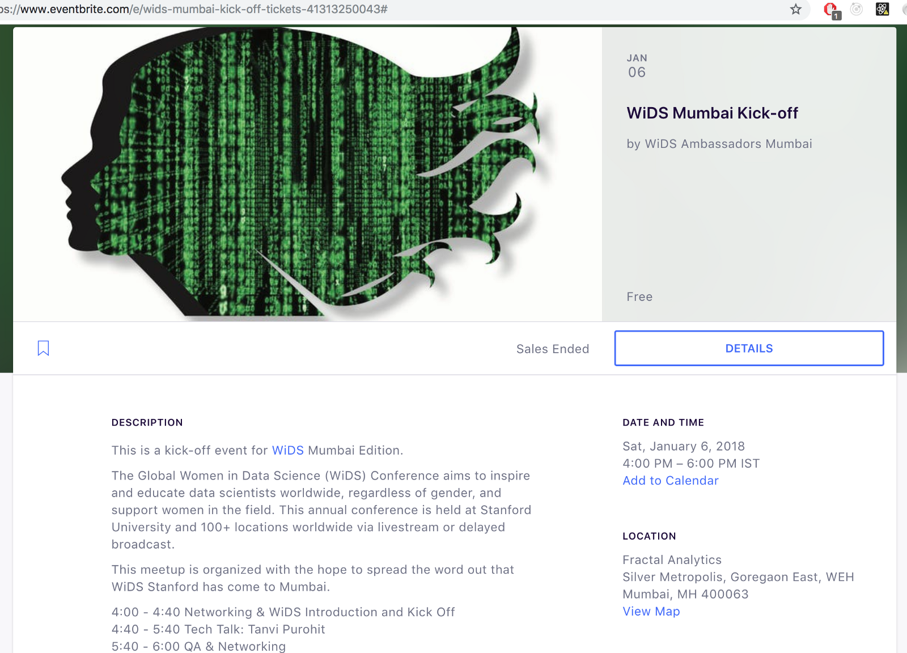
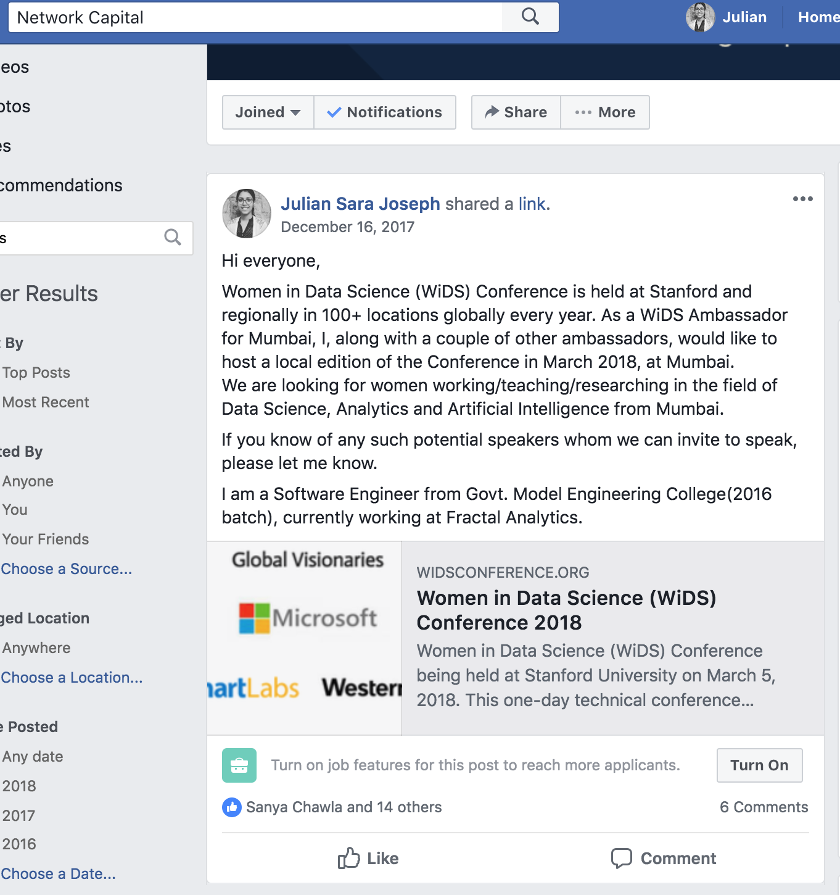

#ThisMonthLastYear

, [aqsa bhimdiwala](https://medium.com/@aqsa.2496), [Karthika Kamath](https://medium.com/@kamathkarthika) and me at the end of it all.](./asset-1.jpeg)

It was around this time last year that I got a message from [Karthika Kamath](https://medium.com/@kamathkarthika) on Twitter about hosting a **WiDS Stanford conference** in Mumbai. I had just signed up as a WiDS Ambassador. From there the journey to the first ever WiDS Conference in Mumbai began. Since the beginning, we were extremely excited about the whole thing, so much, that we never once thought it might not happen! :P So if anyone is looking to start a local chapter, read till the end, I’ll be sharing steps in between the outbursts of emotions!

Being part of a huge network that spanned across countries, we were all the encouraged to keep going ahead, reading about the continuous updates in the widsconference Slack channel.

Step 1: Register to become a [Women in Data Science](https://medium.com/@judy.logan) Amabassador for Stanford . Watch this space [www.widsconference.org](http://www.widsconference.org) Worry not! there’s just a simple google form asking details about yourself.

You will be contacted by the organizer, Judy Logan via mail and promptly given a clear set of guidelines to follow. She was kind enough to connect me with others in the city who had applied too. Then you also get added to the Slack Channel I mentioned earlier. You are also added to their ambassadors page! :)

](./asset-2.png)

Step 2: **Do not hesitate to ask questions!**

I have sent several emails to Judy with a number of questions. Each time, she patiently replied to every question. I remember pinging people I have never said “Hello” to in my office, to find out in what ways I could get _funding, venues, speakers, promotion_ etc done.

Step 3: **Promotion is never too early!**

We hosted our kick-off meetup in Jan.

This helped create an initial buzz that was **essential** to spread the word.

Step 4: **Reach out to sponsors hidden in plain sight!**

That’s right, you never know your potential sponsor might be sitting in the same building as yours. In our case, we found our title sponsor as [Fractal Analytics ](https://twitter.com/fractalites)— the company I work at itself, after a simple shout out to folks in an email. So glad I did! Once you know someone’s got your back, you can really focus on other things.

Step 5: **Find the right venue**.

We knew we were aiming for college students along with working professionals from the start. This came mostly because we had 2 ambassadors [aqsa bhimdiwala](https://medium.com/@aqsa.2496) and [Karthika Kamath](https://medium.com/@kamathkarthika) as final year engineering students themselves. So a major portion of our audience had to be engineering students! :) and what better place to reach out to them than host it at an engineering college itself!

[VJTI](http://www.vjti.ac.in/) Mumbai Alumni (Karthika’s college) not only agreed to give us their auditorium but also became our second sponsors! (Plain sight again see!)

Step 6: **Start registrations** ASAP, coz Numbers matter!

We quickly started another eventbrite event for the main conference and soon reached this:

WiDS conference has this map of all the places where the conference is being hosted simultaneously and Mumbai never came on the map until this year! My joy knew no bounds. :D

\[NOT really\] Step 7: **Find speakers!!!!** — we started this long before any of this. We reached out to potential speakers, eminent personalities through every social media possible.

Our team which now also included [Khushboo Peswani](https://medium.com/@peswani.khushboo19), had similar posts put up in [WiMLDS](https://medium.com/@wimlds) Slack channel, Twitter, Whatsapp, LinkedIn etc. We found several amazing women who were willing to be a part of WiDS Mumbai! I have never been so thankful to social media ever! :) Slowly and slowly, we reached a good number of 9–10 speakers. Our panel of “Speakers” tab on the official website looked bright and shiny. \*eee\*

Step 8: **Planning every detail of the day**.

We had a G-Hangouts group(WhatsApp was too passé) that used to be flooded with “What size should the flex be?” “Do we give merchandise to everyone? ” “Will the speakers need navigation links?” “How will we project the slides with videos?” “Can we have games in between?” “Would they expect snacks and lunch?” “What about stickers and coffee mugs?” “Please review the designs of the posters today itself!!!” O boy, it was a lot of planning. But it was all worth it.

Step 9: **Have a great time!**

You will be  meeting aspiring data-scientists, maestros in the field, superstars who are using data science for fighting crimes, knocking sense into voters, and so many more — all in ONE day! The network built through this, the energy of the audience and the speakers, the questions brought forth. Everything was so amazing, with a crowd of 120+! Not bad for a maiden event eh? :D

 after the event](./asset-6.png)

Yes, thank you everyone who was a part of this!

Stay tuned for WiDS\_Mumbai 2.0 !
