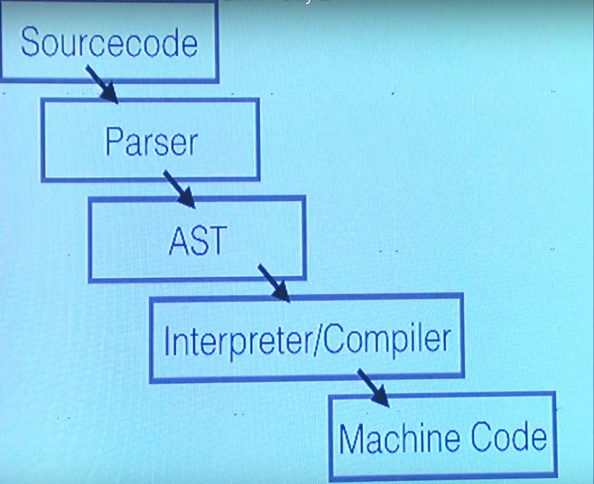
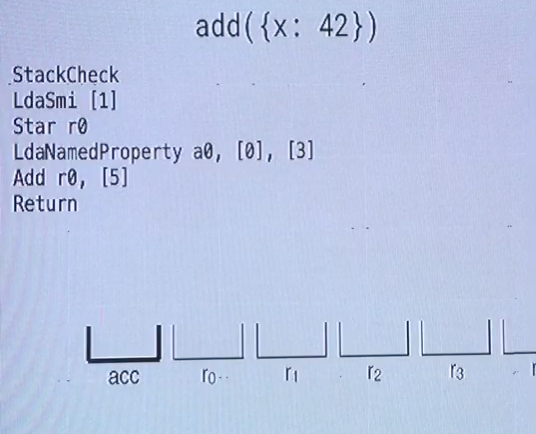

_…continued from_ [_Day 1_](https://medium.com/@jsj14/js-channel-2017-3b389686213)

**Day 2 of JS Channel 2017**

It began with a session on ‘_V8 engines and how they even work’_ \-by [Franziska](https://twitter.com/fhinkel) from the **_V8 Team at Google_.**

She showed us how JavaScript had grown 100x times faster than it was 2001 because of [Speculative optimization](http://richardartoul.github.io/jekyll/update/2015/04/26/hidden-classes.html)! (Yes it gets smarter over time!)

Heads-Up! I’m going to try and recall all the details about this talk coz it was my favourite!

The Source code parsing and conversion into Abstract Syntax tree is explained in this [video at JSConf](https://www.youtube.com/watch?v=Fg7niTmNNLg) :)

Now the next phase — compilers — They convert code one kind of format to another. The talk focused on the last 2 stages shown above — Compiler and Machine Code. All JavaScript compilers use Just-In-Time compilers, and not AOT(Ahead of time), mostly like us engineers who reached the early morning conference just in time. 😎 ([Abhijeet S. Sutar](https://medium.com/@ajduke) [vineet hawal](https://medium.com/@vineethawal) 😜)

The JIT compilation, does not compile everything at the start which is why it is called lazy. 😆 But the advantage is, getting run time metrics- info only available on run, using this, the compiler is smarter by now, alternating between the last 2 stages with feedback.

What makes JIT compilers fast however is the optimization compiler _(called TurboFan in Chrome V8)_, which memorizes 🤓 the **shape of the object** used in functions, hence creating shortcuts when there is a _repeated task (identified as hot funcs)_ like say adding 2 numbers, making use of the intrinsic hidden class as feedback and so speculating the future and performing at a great speed.

Normal, non-repetitive code goes to interpreter for Baseline compilations (_called Ignition in V8_) because the map of the object would be different, since shapes are determined at runtime.(atleast in V8)

Even though JavaScript is dynamically typed, the source code has to be checked for types of arguments, or objects so if developers keep it same for the object and the engine- that is if they kept it statically typed — it would be faster! She was kind enough to share her detailed list of sources [here](https://medium.com/dailyjs/how-do-i-get-started-with-v8-development-17e976ebe4af).

👆 2 of the best slides IMO 👇 She also explained how the ‘+’ operator will be processed by the engine that follows the oracles of ECMAScript with bytecode — using what we learnt all the way back in our 5th and 6th semesters in Engineering! The joy of realizing how all those hours spent in class weren’t in vain. 😅

A team of frontend engineers from _Optium_ logistics and _Postman_ API, I met during lunch that day, further drove this lesson home by describing their development practises that includes using [**‘Flow’**](https://flow.org/) in their state and proptypes while making React Components, how it makes code more readable, more reasonable, and in a nutshell life simpler for all developers!

It helps us with accuracy, and compilers with performance, so you end up working not against the compiler. I can’t wait to start using Flow more profusely in our codebase because there was no other performance advice from [Franziska Hinkelmann](https://medium.com/@fhinkel) , 🚩 than to write code that **_‘looks statically typed’._**

Honestly, everytime my team mates or I leave any property of the object out of scope, or dangling in the air on modification, we are reminded of this talk and how the shape of the object would now be different for the engine 😵

Thank you Franziska!
