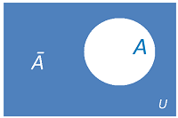

We all know Mathematics. At least some bits of it. And you know what my favourite part is? Venn Diagrams. It helps us understand weird formulae, complex real life scenarios etc. with just simple circles. The intersection, the complementary, the union, all of it makes life so simple.

So, if you wanted to convey something, say A,(Things you want in life), you could either sketch it as a circle marked full of it, or if you don’t have that information(You don’t know what you want in Life), you could also sketch it as a a rectangle shaded on all those areas except the circle in the center, depicting the

> Universe of things(Rectangle) — things you want in life (Circle) = things you don’t want in life.

There is usually a higher chance that you know A’ (A complement) ;)

Often some of the greatest decisions of our lives are made based on this: On what we definitely know should not happen. (I’m hoping it is not just me :P) We might not realize what is it that we actually want, until we actually get rid of what we don’t want in lives.

You may not know what you should be doing. But thanks to your parents, elder brothers and sister, friends and family, you may be well aware of what you should not be doing. It is okay. Because a lot of times, even complex algorithms are solved by knowing exactly what we don’t want. We reach our goals or attain the objective we started with, by first finding out what should be excluded from the given set, leaving behind, exactly what we need.

Maybe with all those attempts to remove elements in your life, that you know you don’t want, you will reach that point when you have exactly what you need. (and you didn’t know that you needed it until you got it :P)
