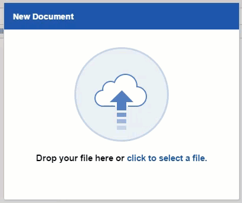

We had been using celery in [Trial Run](http://trialrun.us), for quite sometime, but it was only early this quarter, I got to know the whys behind it. A blog from 2008, made sense even today — [Queue everything and delight everyone](https://decafbad.com/blog/2008/07/04/queue-everything-and-delight-everyone/)! After having read this you can not look at any loading gif or message like the one below and not think of celery!

There are several gazillions of apps today and each one is designed in a way such that we see results instantly(at-least perceive to see results) and Do NOT have to wait!

Now that we know when all we should use it — (every time you want to do something in the background, allow your user to venture out to other things in the app, i.e. Asynchronous. Celery can be single handedly credited for making your code in django work non- sequentially) — lets get down to the hows.

We have machines, and we have task queues, which take “tasks” as input — (duh! )and distributes work across threads or machines.

Now think of Celery, as a choir master, telling different choir members different notes to pick up so that the entire performance turns out melodious.

Only here it is tasks instead of notes, that need to be picked up.

Just like how soprano, Alto Bass, each section handles different scales, different Celery workers will pop out different messages to a broker (RabbitMQ in our case) and so the master can handle the distribution of tasks on workers across threads.

### What was special about my encounter?

Well once, we had 2 different queues lined up, each with a different intention. But of course we had just one worker at a time consuming tasks from both of these. But how will a Celery worker know which to consume from first?

This [good soul](https://stackoverflow.com/a/33005026/4923202) out there seemed to have figured out an internal default magic going on: it simply followed a **round-robin style,** pulling one item from each queue before going on to the next even if all of the tasks were _published_ in the first queue before the second.

Talk about being fair and just.

Happy queueing and using celery to save the day!
