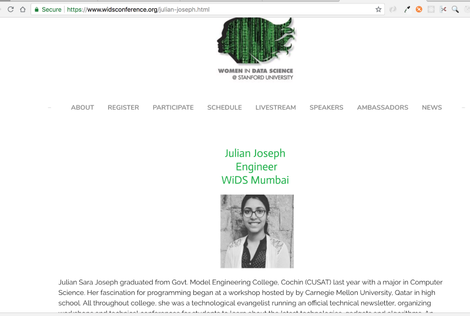

Story-time guys 

So when you see opportunity, and potential — All you need is to find the right people and the constant determination to keep at it until it is done. 

Women in Data Science(WiDS) Conference and Aabhari Magazine. Both were not born in scarcity but in surplus. Surplus of potential and opportunity. 

I was working in a data analytics firm for almost an year, and had just gotten more involved with the network of women in the company. Hosting a WiDS Conference was something that seemed to fit right in — like a hand in a glove. No one in the company had ever been a WiDS Ambassador before! I was just as surprised as before. So signing up for WiDS ended up in 

and in case the
