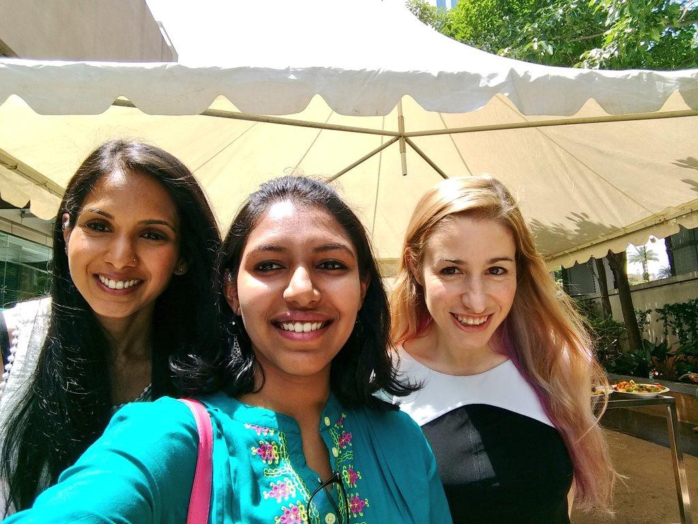
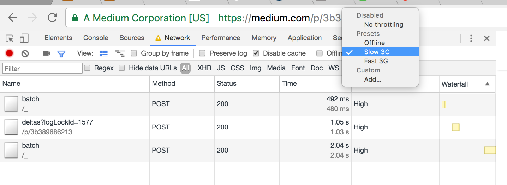

_a gist of all that happened_

When I saw a hall full of people who came to attend the conference from all around the world, I was overwhelmed realizing that I was part of such a big community that included people working full-time on JavaScript as Product engineers, Lead Architects, collaborators of various open source libraries and a even few first timers like me. Every other meetup or conference, I had organized in college or taken part in the last year, usually revolved around some social issue, entrepreneurship or big data 0r machine learning . So a 2 -day conference on just JS was totally new.

It was just Day 1 and we already had received checklists of what our JavaScript code should look like, how we should be able to reason about it and how we should keep it performant (yes it isnt [a word](https://weblogs.asp.net/jongalloway/performant-isn-t-a-word) :P).

The day began with the Keynote by Preethi [Kasireddy](https://medium.com/@preethikasireddy), who just as her blogs, seemed to ‘make sense’ with her slides on the stage. It was literally like _anyone can be a programmer, coz it just makes sense!_ She stressed on how we could keep our code **free of side effects and generic.**

[Preethi Kasireddy](https://medium.com/@preethikasireddy), had taken up Software development from being a Systems Engineer only an year ago ( I think) and rightly stood witness to the fact that extra effort and eagerness to learn could take you anywhere you wanted :)

Fast-forward to lunch at Marriot, I mustered up the courage to speak to these goddesses. [Sarah Drasner](https://medium.com/@sarah_edo) described how everything is under a process of reaching abstraction, saying:

> What you need to know is that in the end, ‘Engineering’ is a field where people accept anyone taking up anything. You just have to be a flexible engineer to adapt to new tasks, ready to build things.

[She](https://twitter.com/sarah_edo) took a session on Animating Vue.js with pretty cool [animations](https://codepen.io/collection/XQGkeV/) in codepen later that day. Its so nice to have people willing to share their projects and take time to teach beginners in Vue and frontend developers like me, who are familiar with only React. Thank you [Sarah](https://twitter.com/sarah_edo). Loved it.

After lunch we had more talks lined up one after the other.

One of them being, about Performance for PWAs where [Siddarth](https://twitter.com/siddharthkp) from Practo, suggested how a **_2 stage architecture that_** sent static Html yet meaningful information when the user requests for it before you actually hit the api for it would be better than annoying them with a blank page. The user can be shown an enhanced page (with the JavaScript and CSS loaded later) after a second or two.

Another cool thing he mentioned was the use of service worker to cache the urls that will be frequently used by the users on the page. Thank you Siddarth. Especially for the following trick:

Every girl/guy I bumped into was a full-stack developer who used React or Angular, backed by Python, or Java or ASP.Net. It was thrilling to see the diversity yet similarity in all of us. Everyone was eager to share and learn as much as they could for 2 days from the speakers and from one another.

There was also this little girl, [Simone](https://www.instagram.com/p/BXKnVOPjo9iN-ahDI8dXfjkeJaCahaX-e73V140/?hl=en&taken-by=juliansarajoseph), 👧 at the conference bubbling around with energy all throughout the lunch break.

When the time came for flash talks by attendees, everyone was surprised to see [her get on stage](https://twitter.com/sarah_edo/status/890893261404897281), and by the end of 5 mins the entire audience had imposter syndrome I think! 😅 Why ? At the young age of 10, she had an endless list of side-projects 28+ Scratch projects that she had toiled upon for months. (side-projects, because she still has to go to school 😜). Her energy and passion was truly contagious. 😃

Do check out her videos and support her([xlarge\_hamster](https://www.youtube.com/channel/UCPGKU_tzBZ-xU7p8hUuZQqA)). She’d go crazy with happiness :P 💃 💃

It was great to see how welcoming our diverse community of engineers was, how we love to hear from anyone who is passionate about building things from M[inecraft](https://www.youtube.com/watch?v=-LcdpQ2LLK0) mods, SVG animations to Browser Engines.

There were also talks on React-Native, which helped us understand what React-Native offered.

[Parasuram](https://twitter.com/nparashuram?lang=en), from _Microsoft_, with a lot of gifs and memes brought the house down as he explained the Time-travel debugging dev tools that the special combo of React-Native, ChakraNode could offer. 😆

**Workshops**

For Day-1’s hands-on workshop, we had [Max Stoiber](https://medium.com/@mxstbr) introducing his library[, Styled-components](https://github.com/styled-components/styled-components). Do check out this amazing library where one doesn’t need a pre-processor to load these styles, as he seems to have taken care of everything, from custom components to test cases. He had answers for everyone and was clearly a favourite.

Moments before the workshop for Day-2, [**Farhad**](https://twitter.com/farhadg_com) **very** calmly announced the release his book [**U&I with React**](https://leanpub.com/ui-react)**!!** He had been working on for an year since last JS Channel, andnot only did he give us all a free copy of it through _leanpub_(with a special option JSChannel to check at the time) but even walked us through several chapters of the book, showing us how to keep our styles _unidirectional,_ isolated and extendable . He was open to all of our views and tried to convey how styling user experience can follow a rational thought flow.

**Day 2** began with Franziska’s talk which I have devoted another post to, [**check it out here →**](https://medium.com/@jsj14/js-channel-2017-b9e517e27a92)

The last day ended with [Andrew Clark](https://medium.com/@acdlite)’s talk, something we all looked forward to from the start! He not just works as a dev in **_React Team at Facebook_** but also teaches and delivers talks about React within the team for newcomers.

He was overwhelmed by the large number of people in the room who used React for their web applications in production. (🙌). He described how the concepts of **Declarative programming** and **unidirectional data** flow seems to have influenced almost all the other JavaScript libraries and mainly developerX. 😎 (developer-experience 🙂)

Once again, performance trade offs were focused on in this talk, as it is the major concern for every dev team out there. But to someone who has only used React, it was hard for me to follow how other frameworks helped or claimed to be more performant or simply better than React. 🤔

So when Andrew talked about how the React team at Facebook, focused on not just _reducing the total work_ or checking on the speed of code processing or the internet speed at serving responses — but on proper scheduling of events, requests and tasks, which he termed **_Cooperative multitasking_** because JS in browser is single threaded and can run just one thing at a time — I think everyone who was ‘pro-react’ (which was almost 3 quarters of the room) beamed with glee. 😊

There was also a feedback session enforced in the last 10 minutes of the day, which went a little out of control 🙄 but was fun too! 😉

It was a great experience meeting so many developers from so many places.

Thank you JSChannel! Thank youTrialRun! :)
