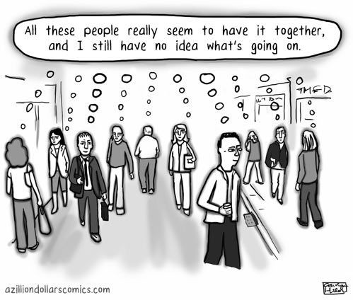

Everyone is not themselves, every time. They are all under a mask, they behave as they are expected to. True, there are anomalies for every thought. So there are a few gems that do not change shape or colour according to the situations, trials and stand their ground with unshakable principles.

But as a general rule, people live in this society as they are expected to. \[What happens when we fail those expectations? aah lets save it for another story?! :P\] They are indeed playing their roles as per the script. Yes Shakespeare got it right indeed! “All the worlds (certainly) a stage” Were we supposed to live these lives?

I strangely find myself hoping that I play my part, and play it well.
