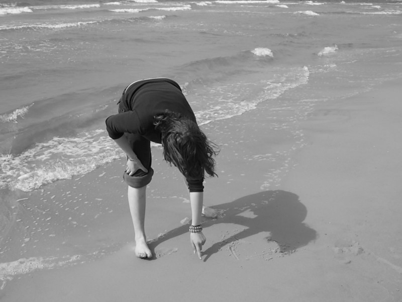

2 min read

Did you know that a lot of people list _‘fear of the future’_ as one of their worst fears? So what happens if you have people around you predicting your future for you, in ways you obviously don’t wish it would end up in?

Well You simply “breathe in” and “breathe out”. :D \[Not kidding it helps\]and realize the stark reality that No ONE in this whole wide world could predict if you could actually exhale that breath out. \[aka the breath of life :)\].

Then isn’t it obvious- that they have no power to predict the rest of your life’s events and relationships.

Yeah not even your astrologist! To everyone, who spends their morning hours checking out their daily horoscope in the newspaper or Facebook (even sharing it \*Sigh\*), I have news for you guys, those words aren’t true.

Trust me on this. There is no thing called “prediction” when it comes to a person’s life. \[Since prediction data sciences are shaking up the world as we see it now\]. There is no thing called “luck” either. No ‘Good’ Luck. No ‘Bad’ Luck. No omens either.

> **You are the creator of your life.** _You decide what you will become. You write the story of your life._

Engrave those words in your mind or emboss it in your hearts. It is all in your hands.

Do yourself a favour, and turn a deaf ear to all those _stereotypes, conclusions, assumptions and predictions_ people around you make about you.\[Bhaad mein jaane do yaar\]

Yeah, you may have regrets. [Muhammad Althaf](https://medium.com/@althaffe) But they should not take away any of your time in making the most of your present life right now, or of opportunities that may come knocking any time.

You don’t have to ruin your day. You don’t have to sulk either.

Just be who you want to be. :) They can’t stop you.

---

_Originally published at_ [_jsj14.withknown.com_](https://jsj14.withknown.com/2016/predictions) _on February 10, 2016._
