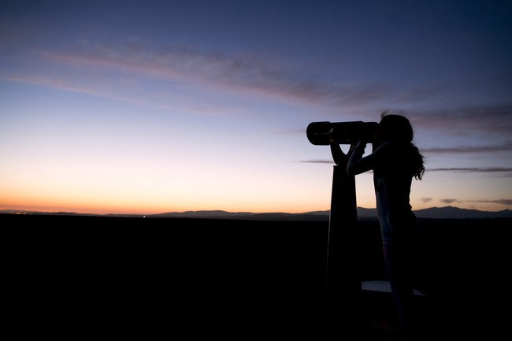

It is only recently that I observed how people around me listen to or see or perceive things. They always see things, whatever it may be, from their point of view, which has taken all their lives to create (or maybe not).

For eg. my mother who is a teacher, will view everything as a teacher and bring each discussion to end with how one can benefit from being a teacher. \[irritating even though I agree with her :P\] My Dad too does his own share.

There are very few people who can put themselves in others’ shoes and view life, \[or the topic of current discussion for that matter\] from a point of view different from theirs, seeing things as they see it. What you could perhaps do in order to get this nature, is I believe, by reading. Read a lot, on a lot of topics ranging from microbiology to psychology, by talking to different people from different walks of life, from different cultures and countries.

When you talk, try to actually listen, without all those cluttering prejudices and preconceptions blaring inside your head.

Knowledge is definitely power. \\/ ;)

---

_Originally published at_ [_jsj14.withknown.com_](https://jsj14.withknown.com/2015/see-it-as-they-see-it) _on August 30, 2015._
