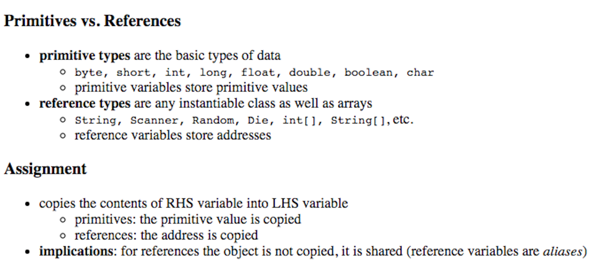

We have all had those days when we trusted Object.assign, when we just learnt about call by values and call by references and seemed lost about how to deal with copying values in JavaScript.

Well in most cases, knowing that Object.assign only makes a shallow copy helps by which I mean it does a superficial copying act, and deep down acts as a reference to the original object

And pretty soon, you realize, how the only trustworthy alternative to the above mess, is using

`` `JSON.parse(JSON.stringify(Object-you-want-to-copy)` ``

This hardly ever messes things up like Object.assign.

However there are scenarios where you would want to use Object.assign.

```
const cat = {}
const con = {} 
const catAndCon = Object.assign({}, cat, con) 
```

So if there are multiple sources and one target, Object.assign is at your service.

```
const abc = Object.assign ([], this.state.abcObj, some_otherSource)
```



The above picture is my most profound learning today — Understanding that the primitive and reference types have different rules for copying and referencing.

I would encourage all of you take a print out of this and pin it on your desks.

So next time you hav[e numbers,](http://pages.cs.wisc.edu/~bahls/cs302/PrimitiveVsReference.html) fear not, copy it easily into another variable **with mere assignment!**

Note: It doesn’t work with arrays, strings.

If you are [SO fans](https://stackoverflow.com/questions/13266616/primitive-value-vs-reference-value/45513681#45513681) click away : )
