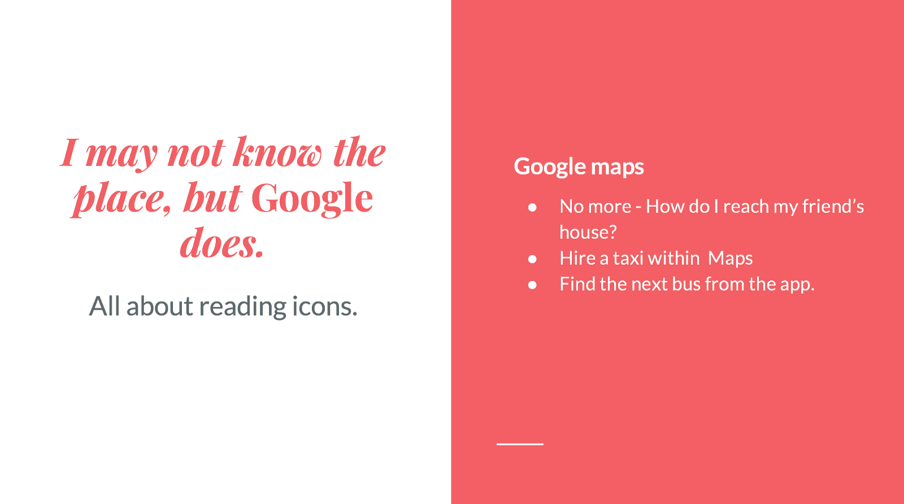
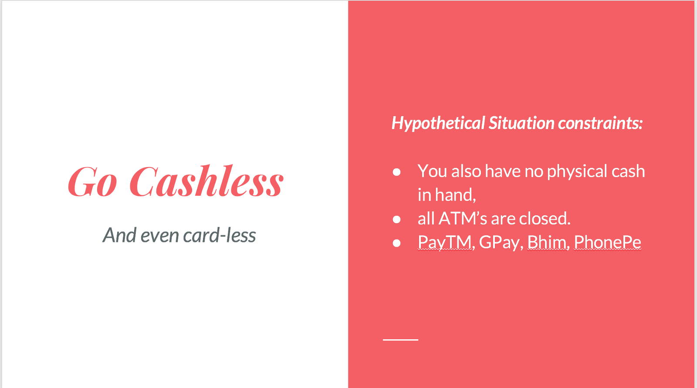
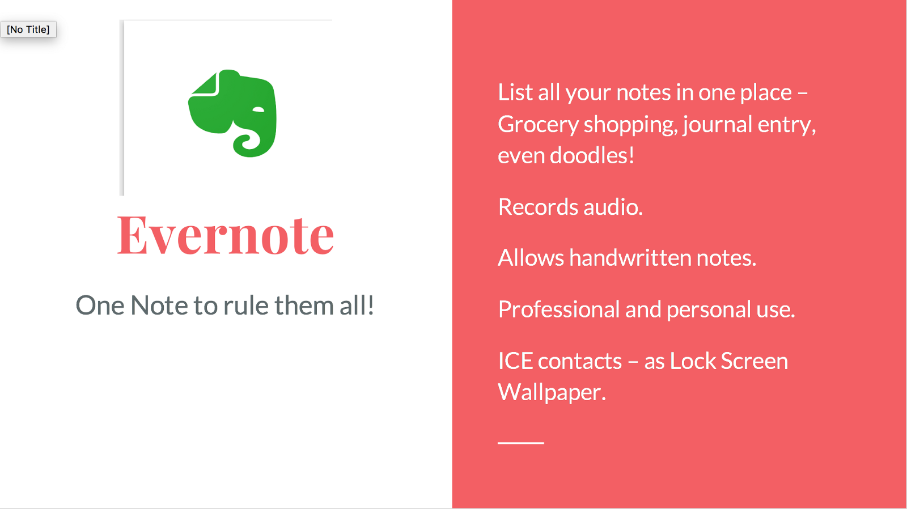
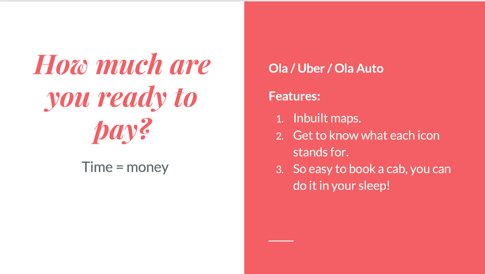
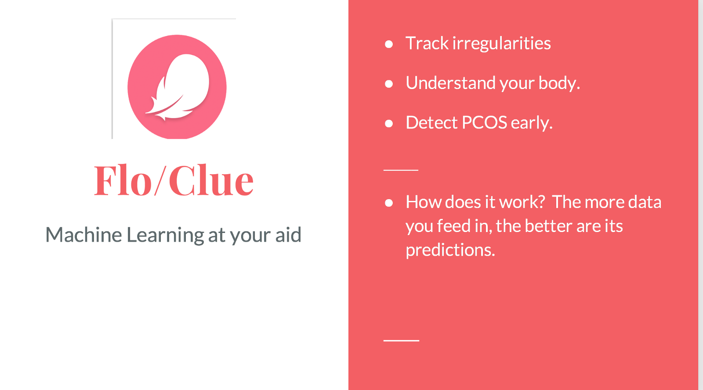
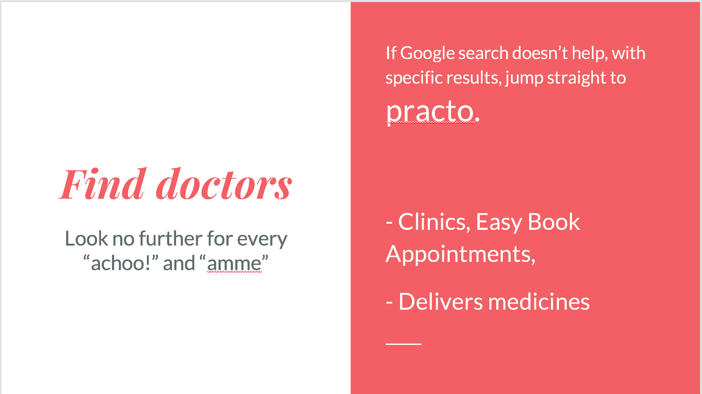
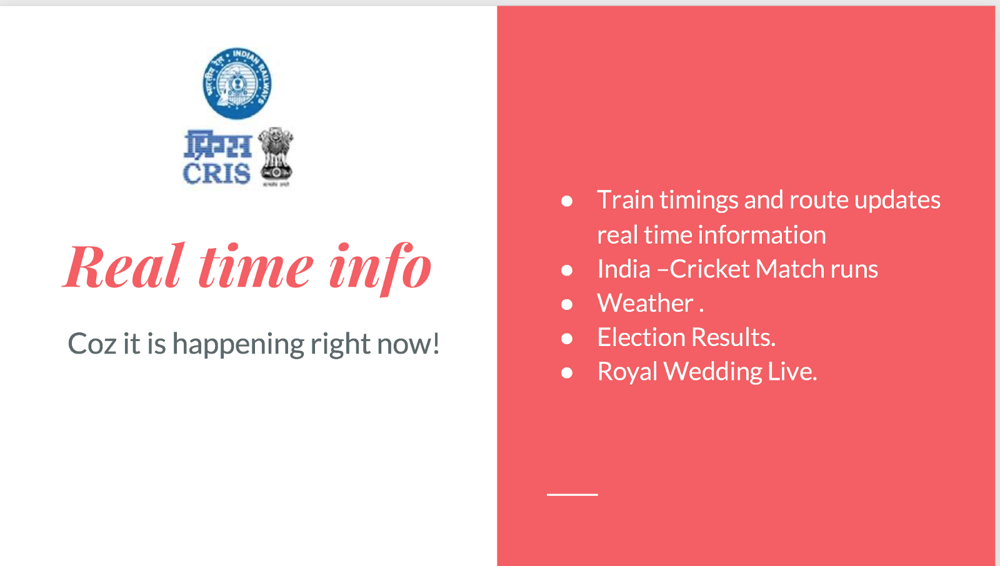
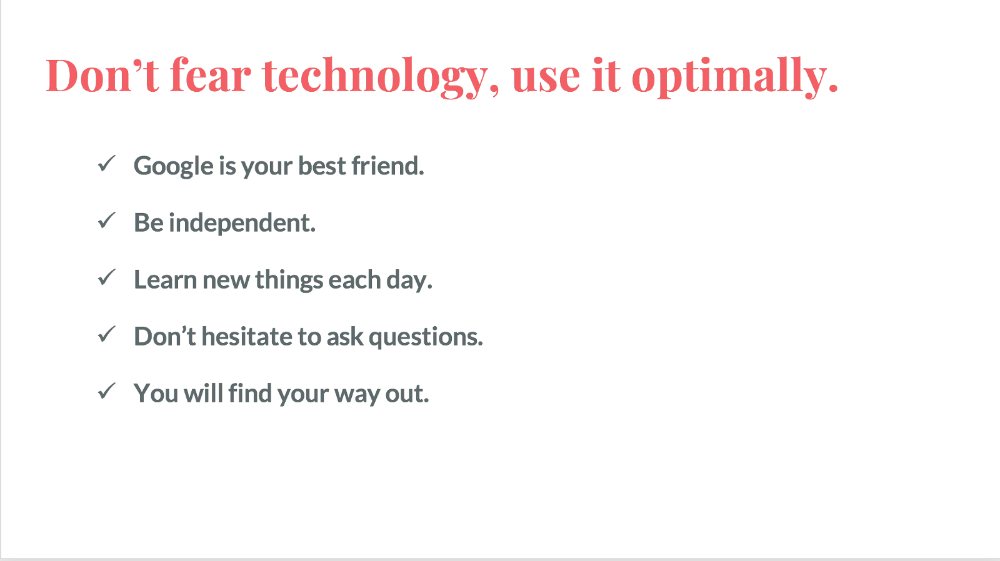

A few months ago, I was asked to give a talk on “Technology” at **She31**, a 2 day conference for women held at my church. Even though I agreed to do it with apprehensions, I realized the audience, which had a major proportion of elderly women, were eager to jump on the band wagon of technology, (if not already) to not just remain relevant but to actually rely on technology for their day to day tasks.

The session was supposed to be a 40-min one, but it went long after that with questions and demos. The following is list of things I ensured the ladies were aware of, by the end of the talk.

1.  [Google Maps Street View](https://medium.com/@directions2016.com) has been a life saver for me personally, since I reached Mumbai, so this had to be first in my list. We learnt how to find the distance, time it takes to go to the nearest hospitals, find the timings of the buses in the next hour, and even hire a taxi from within Maps!

2\. When Demonetization happened in 2018 [Paytm](https://medium.com/@paytm) came to our rescue and ever since, every retail/Kirana shop has had a QR code sticker on it door! We went on in detail discussing how RBI made new rules, what UPI Id means and how a transaction was kept secure by apps like PayTM, Google Pay, Bhim etc.

3\. We also obviously discussed of the various online food delivery and grocery delivery apps and ways to find organic fruits and vegetables online. for eg: [Fresh India Organic](http://www.freshindiaorganics.com/), [DMart Online](https://www.dmart.in/), [BigBasket](https://www.bigbasket.com/) etc.

4\. [Evernote](https://medium.com/@evernote) was introduced to me by [Abhijeet S. Sutar](https://medium.com/@ajduke) and I have been a fan ever since. So this was a must. We learnt how to go about writing and recording lists in it.

5\. Travel has been made easier thanks to cars, trains and roads? Ofcourse, but we are far beyond that! We learnt the ease of hailing cabs using Ola and [Uber](https://medium.com/@Uber). There is no need to go out and wave your hand at the next available car if you have a phone in your hand!

6\. After 10 hours at work, coming home to a messy house that needs cleaning and kids to tuck in bed, no woman has time to look after herself these days. But there are apps to keep track of everything right? So why not a period tracker. There is no need to wonder why you are feeling low or angry for absolutely no reason! (Iykwim :P)

[Clue](https://medium.com/@clueapp) and Flow have been extremely helpful with their timely reminders and insights.

7\. Medicines were a mandate for most of those listening to me and I realized [Practo](https://medium.com/@practo) would be a great help. Even though it charges for delivery — they could atleast be sure they would have their stock of medicines refilled on time.

8\. My dad is someone who mostly disapproves of tech ( “Facebook/WhatsApp is meant for those who nothing else to do in life” :P ) but when I asked him what app I should definitely include in this presentation, he was quick to suggest this: [National Train Enquiry System Android App](https://play.google.com/store/apps/details?id=cris.icms.ntes&hl=en_IN). He relied on this every time he took a train-journey.

9\. In an age, where we all have phones and Internet packs are dirt-cheap, there is no reason for anyone to not use technology be it for tracking health or your daughter on her way home. So we discussed how [Glypmse](https://play.google.com/store/apps/details?id=com.glympse.android.glympse) works and even the feature of [m-indicator](https://play.google.com/store/apps/details?id=com.mobond.mindicator.mumbai) that **_allows you to track a person if he/she misses your call 3 times consecutively._**

10\. Finally, even though mothers are already good at this, I showed how tech could make it easier to convince their partners about their spending and budgets.

[Walnut App](https://medium.com/@getwalnutapp) and [AndroMoney](https://medium.com/@andromoney) have been my personal favourites for all their visualizations and reprimanding reminders on my spending habits.

Regardless of how old you maybe, there are several simple tech hacks to living life in this century. Make the most of it.

> “Technology is a gift from God. After the gift of Life it is perhaps the greatest of God’s gifts. It is the mother of civilizations, of arts and sciences,” said Pinky Kekana, Deputy Minister of Communications, South Africa

Keep finding ways to make your life simpler and easier with the help of technology !

_Do let me know what else I should have added in this talk. :)_
