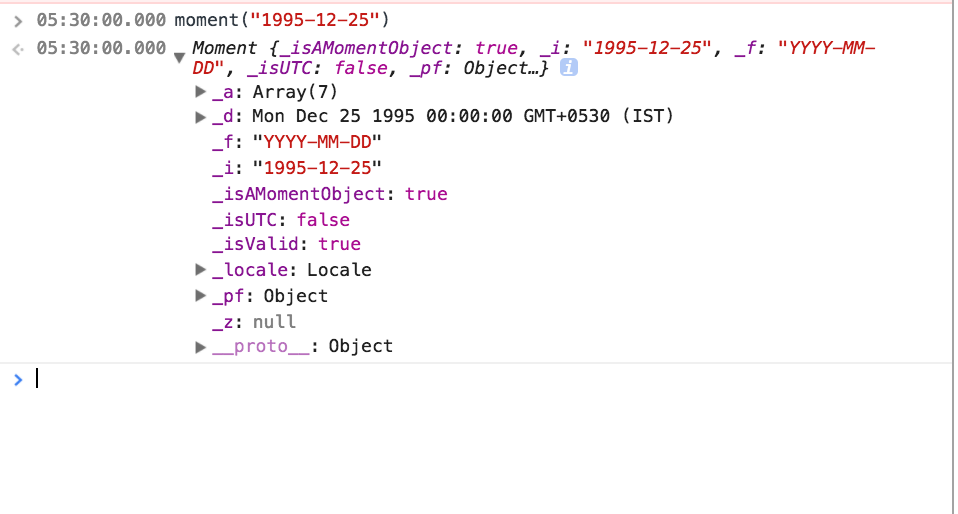
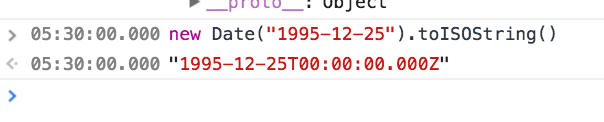
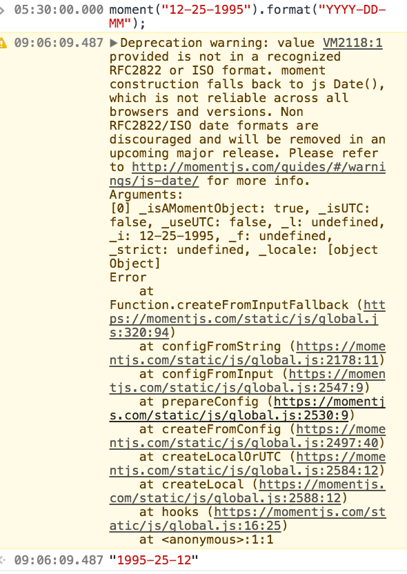

It was the 4 month, since, I had started my professional career, when I first started playing with [moment](https://momentjs.com/) functions. It is supposed to be that life-saver library, recommended by most cool geeks in the JavaScript community. Like every other library, it comes with a manual that shows how everything is made simple and easy with its cute functions that can even be chained indefinitely (I think).

It hides away all those difficult-to-grasp details of converting time from one format to another, adding ‘weeks’ or ‘days’ to a ‘date’ etc. It does all the heavy lifting and presents us with easy-to-remember and use functions.

Only catch — it accepts ISOFormat only.

FYI: It works in the browser too! You just have to require it once. :) It is the first line in their docs. 😅

Please remember the value returned when consoling the moment-type dates is an object of moment and not the string format of date that we are used to seeing in date-pickers.

Another FYI: If you use [MongoDB](https://www.mongodb.com/), then please note that the \`Date\` type in your [Schema](http://mongoosejs.com/docs/guide.html) converts all dates(regardless of their formats) into **‘ISO DATE’**

A favourite moment was when I was able to add and subtract weeks using the moment functions as below:

`moment(week).add(number, ‘weeks’)`

`moment(date).subtract(numOfWeeks, ‘weeks’) + 0`

aha bliss right! 😄 (Theres a reason for adding that zero — it will return the input number with which the moment object was made. In a nutshell, if you do not want to deal with a moment object but instead need just the number please add a 0.)

Now there may be times when you have to convert from one time format to another. Format being DD-MM-YYY or MM-DD-YYYY or YYYY-DD-MM etc

Uh-Oh. Deprecation warning! (Even though it returned the desired value)

So going back to the basics of **moment**, you realize that it takes in any string of ISO format and if not of ISO format then please mention the format. Funnily enough `.format()` runs on a string sent to moment without raising the above deprecation.

`> moment(new Date(‘2017–06–29T18:30:00.000Z’).toString()).format(‘MM-DD-YYYY’)`

`> “06–30–2017"`

_Edit_: If there are any souls out there working with dates in Chrome and Firefox. 🚩 This is for you. Before you lose it.

`new Date (‘05–15–2017’)`

This results in ‘**_Invalid date’_** in FireFox, but returns the expected Date object in Chrome. It is `moment('05-15-2017', 'MM-DD-YYYY')` that comes to the rescue here! 🎉

Also `.toISOString()` works on both Date object and Moment Object. 🍻

There were of course a lot more special moments with Moment.js. I’ll share more soon.
