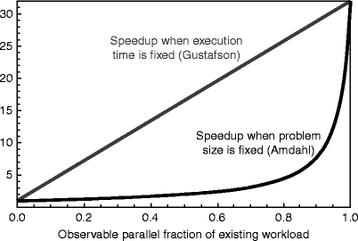

You might be aware of [Test and learn](https://en.wikipedia.org/wiki/Test_and_learn) approach -(At least in the form of A/B testing most companies use with their email campaigns).

I’d like to relate it to the [Gustafson’s law](https://en.wikipedia.org/wiki/Gustafson%27s_law), which I stumbled upon last week, in my attempt to understand benchmarking of processes [Trial Run’s](http://www.trialrun.us) development team was focusing on.

Gustafson’s law’s Derivation:

A task executed by a system whose resources are improved compared to an initial similar system can be split into two parts:

-   a part that does not benefit from the improvement of the resources of the system;
-   a part that benefits from the improvement of the resources of the system.

Now if we were to compare these two parts — we would have exactly what is called ‘control’ and ‘test’. This approach helps us isolate the effects of a change and compare the evolution of a unit affected by a change.
