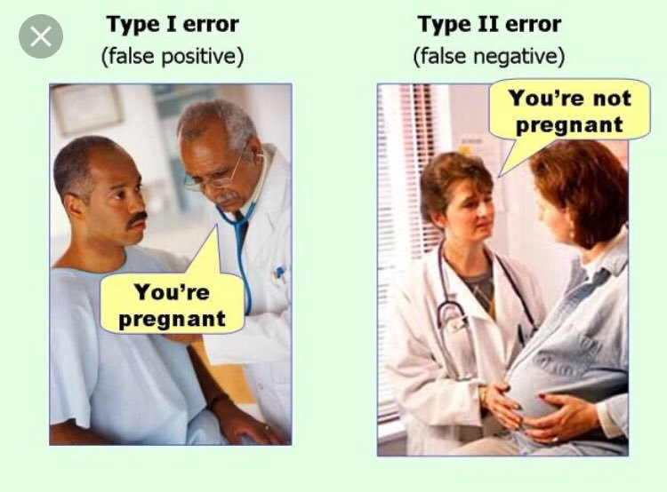

After [today’s talk](https://www.linkedin.com/feed/update/urn:li:activity:6492063801456857088/), when everyone in the hall screamed out that the way to learn Data Science is not **_Bottom up, but Top-Down,_** (i.e. whether one should start with mathematics, then statistics and then machine learning, Neural networks etc(Bottom-up) or get an overview first of what ML algorithms would entail and then go about researching just what is needed (Top-down), I made up my mind to publish this almost buried draft.

When we took up the studying Data science in [Trial run](https://www.trialrun.us/), it was an entirely different approach, from the ones, everyone out there suggested today.

We started with basic statistics and then leaped into algorithms. The journey of Data science seems endless with this approach. But you be the judge.

The following was our initial set of topics to cover:

1.  Hypothesis Testing.
2.  t-test
3.  Correlation
4.  Linear Regression
5.  Extension of linear models: Regularization

Our recommended source : [ISLR](http://www-bcf.usc.edu/~gareth/ISL/). The Bible of all statisticians or should I say, Data Scientists.

For each of these, however Ganesh and I, read about exceptions and assumptions as we came across them, from the following sources.

Hypothesis Testing: [https://newonlinecourses.science.psu.edu/stat414/node/290/](https://newonlinecourses.science.psu.edu/stat414/node/290/)

The better you understand this, the easier the rest of it gets.

t-test and z-test were simple enough once you got the hypothesis testing. Unless like me, you keep forgetting the formulae. Psst: pro-tip — dont learn the formulae, derive it yourself.

[**Understanding the Bias-Variance Tradeoff**  
_When we discuss prediction models, prediction errors can be decomposed into two main subcomponents we care about: error…_scott.fortmann-roe.com](http://scott.fortmann-roe.com/docs/BiasVariance.html "http://scott.fortmann-roe.com/docs/BiasVariance.html")

This tradeoff was ofcourse our favourite topic, after the confusion matrix of Type 1 and Type 2 errors.

Error in Models: [http://scott.fortmann-roe.com/docs/MeasuringError.html](http://scott.fortmann-roe.com/docs/MeasuringError.html)

Gradient Descent: One of the key takeaways from Andrew Ng courses is the explanation on this one concept. Check out this dedicated course on the same.

[**Gradient Descent For Linear Regression - Linear Regression with One Variable | Coursera**  
_Machine learning is the science of getting computers to act without being explicitly programmed. In the past decade…_www.coursera.org](https://www.coursera.org/lecture/machine-learning/gradient-descent-for-linear-regression-kCvQc "https://www.coursera.org/lecture/machine-learning/gradient-descent-for-linear-regression-kCvQc")

There were times when we dug deep and asked questions, questions that luckily enough were already raised and answered in the datascience.stackexchange (another place you can definitely turn to in times of trouble) for example:

[**Why do cost functions use the square error?**  
_begingroup$ I'm just getting started with some machine learning, and until now I have been dealing with linear…_datascience.stackexchange.com](https://datascience.stackexchange.com/questions/10188/why-do-cost-functions-use-the-square-error "https://datascience.stackexchange.com/questions/10188/why-do-cost-functions-use-the-square-error")

Surely we did try several gists like these:

[**Evaluating a Linear Regression Model**  
_I am Ritchie Ng, a machine learning engineer specializing in deep learning and computer vision. Check out my code…_www.ritchieng.com](https://www.ritchieng.com/machine-learning-evaluate-linear-regression-model/ "https://www.ritchieng.com/machine-learning-evaluate-linear-regression-model/")

If you don’t come across these questions, it DOESN’T mean, you haven’t studied! Everyone has their own path of discovery. This was ours.

**Assumptions that must hold true always**

[**Going Deeper into Regression Analysis with Assumptions, Plots & Solutions**  
_Introduction All models are wrong, but some are useful - George Box Regression analysis marks the first step in…_www.analyticsvidhya.com](https://www.analyticsvidhya.com/blog/2016/07/deeper-regression-analysis-assumptions-plots-solutions/ "https://www.analyticsvidhya.com/blog/2016/07/deeper-regression-analysis-assumptions-plots-solutions/")

We had a hard time trying to wrap our minds around this, I still need to revise this again I think. But it is definitely worth a read.

Next was the Regularizations: a) Ridge, b) Lasso and Elastic Net.

We did turn to AV again for their complete tutorial — [https://www.analyticsvidhya.com/blog/2017/06/a-comprehensive-guide-for-linear-ridge-and-lasso-regression/](https://www.analyticsvidhya.com/blog/2017/06/a-comprehensive-guide-for-linear-ridge-and-lasso-regression/)

It was true bliss, when this dawned on us. (I’m doing a recap, right now!)

This was another pdf, which had the assumptions mentioned.

The next topic was obviously “Logistic Regression” — which deserves a separate blog post entirely.

See you soon.
