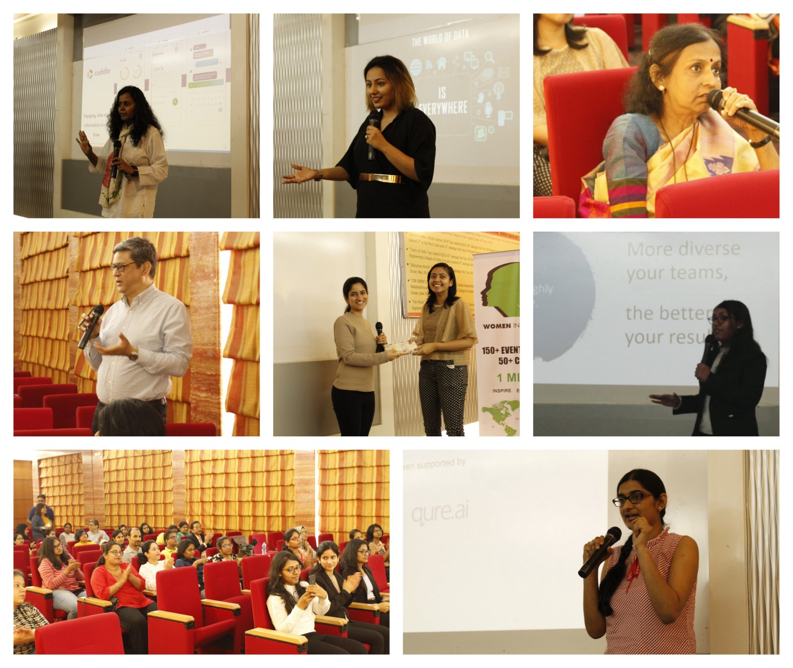

Last Saturday, Fractal Analytics sponsored the [Women in Data Science(WiDS) Mumbai](https://sites.google.com/view/wids-mumbai) Conference for a second time! **_#FractalforWiDS_** made it possible for us, WiDS Mumbai Ambassadors, to create a platform that celebrates women in the field of Artificial Intelligence and Machine learning, and encourages women to choose and to remain in the field of Data Science.

So far, in these 2 editions, we are proud to have featured 17 amazing women who apply Data Science in various industries.

“To inspire and educate data scientists regardless of gender and to support women in this field” is the mission of this [Global initiative started at Stanford](https://www.widsconference.org/) 4 years ago. Today, it has spread to more than 50 countries and 120 cities. I’m thrilled we could bring it to our city too! I still remember the first hangouts call at the break of dawn with Judy ([Women in Data Science](https://medium.com/@judy.logan)) in 2017, when she shared the objective of WiDS, I was all in since then.

This year we also got licensed by Stanford, and [Shelly Darnutzer](https://medium.com/@shellydarnutzer) guided us in the entire process. Thank you!

WiDS Mumbai 2019 witnessed Business Leaders, Entrepreneurs, Educators and Professionals who have been working in the Data Science field from 2 years to >20 years! It was a whole day of inspiring stories, enlightening experiences and where we learnt different ways one can use data to make this world more efficient, more human and beautiful.

**A glimpse of this year’s conference:**

With a Keynote and 8 technical vision talks scheduled on topics ranging from AI in Cybersecurity and National Intelligence to Emotional intelligence and Healthcare, the conference took place from 9am-6pm, on 16th March. There were networking breaks in between with refreshments and a delicious lunch.

**Raj Aradhyula** kick-started the conference with a Keynote address highlighting the ‘How deeply human, AI really is and should be’. She left us pondering on a question “Have we created a world so incompatible for women, that out of every 100 women who enroll for STEM courses, only 12 graduate and out of those only 3 remain ?”

[Tanvi Purohit](https://medium.com/@tanvipurohit) an Analytics Vidhya Volunteer, currently working with Mahindra Rise, shared how her company was applying Data science to make dreams come true for the thousands of villagers in India, thus, shaping the future of Rural India.

**Kamolika Peres,** Technologist and Vice President (Sales) from SAP spoke about how the firm was improving models and algorithms internally due to the huge availability of data, the new currency. She also represented SAP Next-Gen, staunch supporters of WiDS and one of our partners for the event.

[Deepa Naik](https://medium.com/@dynaik), the cofounder of Cogitari, shared her experience of working on the ‘Internet’ decades ago and explained how her versatile background of Statistics, Management, and CS helped her pick up new technologies with ease. Today she builds models for detecting human emotions. She also emphasized the need for “being more human” in this progressive age of AI.

[Soma Halder](https://medium.com/@sohalder), the author of the book [Machine learning for Cybersecurity](https://www.amazon.in/Hands-Machine-Learning-Cybersecurity-intelligent-ebook/dp/B07FNVYSN3?tag=googinhydr18418-21&tag=googinkenshoo-21&ascsubtag=_k_EAIaIQobChMIseWV_ciN4QIVlBePCh0hHAX4EAQYAyABEgLZNfD_BwE_k_&gclid=EAIaIQobChMIseWV_ciN4QIVlBePCh0hHAX4EAQYAyABEgLZNfD_BwE)**,** walked us through the various ways of detecting vulnerabilities in a website, and ML algos used in the space of cybersecurity. She spent time answering questions and breaking down the complexities of the field.

[Ritu David](https://medium.com/@RDConsultingIN), the founder of Data Duck, shared her story of becoming a ‘Data Diplomat’ as she worked with the National Intelligence teams in Australia in her early twenties. She explained how one can use the data present everywhere today to shape all decisions- be it helping the Army to thwart a future attack or designing a Football Stadium.

**Madhavi Kandalam’s** session shed light on how we could make optimal use of the data we get for each problem. She explained different data enrichment and machine learning methods used in Loyalty programs, in an interactive session and encouraged the audience to pitch in different solutions too.

**Dr. Anala Pandit,** a dedicated educator, 3 time IBM Drona Award winner with a wide range of qualifications in Computer science, Physics, Electrical Engineering, was a treat to all WiDS Mumbai attendees. She emphasized on getting the thought-process right before jumping to any algorithm. Her love for learning was contagious and left us all curious about the different ways big data could be handled when we have limited memory and architecture.

Lastly, for a room full of people interested in applying data science to healthcare industry, @Swetha Tanala

**Swetha Tanamala** from **qure.ai** took an informative session on how CNNs were being used to aid doctors in reducing their diagnostic errors while reading X-rays. This was the most awaited session of the day and Swetha did a great job, answering questions on down-sampling and importance of using the right architecture and tech to improve the accuracy of models.

I’m grateful to each and every one of them for taking out the time from their busy schedules to be with us. I’d like to thank all our speakers, participants and my team of enthusiastic co-ambassadors ([Karthika Kamath](https://medium.com/@kamathkarthika), [Khushboo](https://medium.com/@khushboo.peswani) [aqsa bhimdiwala](https://medium.com/@aqsa.2496), @himanshi kothari)who helped WiDS Mumbai make history again! 🙂

We are planning more sessions for students/professionals in the coming months. Stay tuned. [Facebook](https://www.facebook.com/widsMumbai/) | [Twitter](https://twitter.com/WiDS_Mumbai)

Special thanks to Raj, Anish, Manoj, Manish, Vinay, Rooshika, Sharmila, Amit, Mili, Pankesh, Sruti, Swapnil, and to everyone else for their support in making this happen this year too!

Julian Joseph

[WiDS Ambassador](https://www.widsconference.org/julian-joseph.html) | Mumbai
